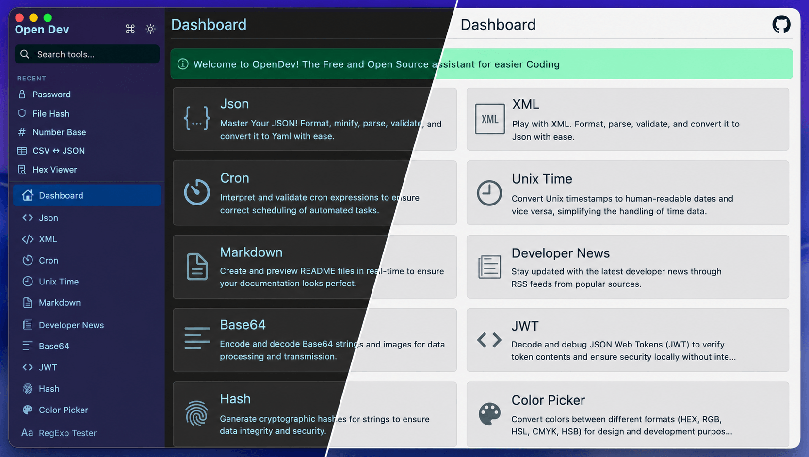
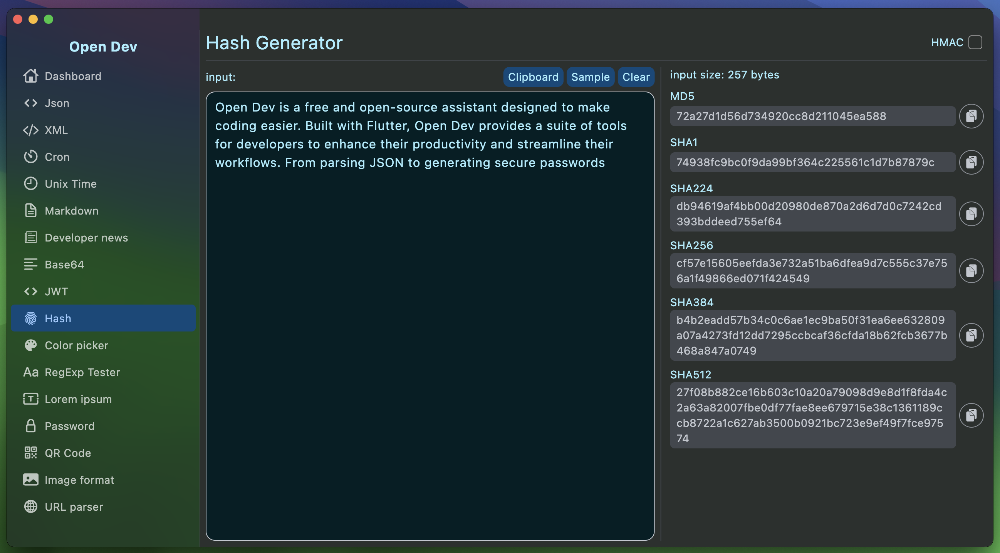
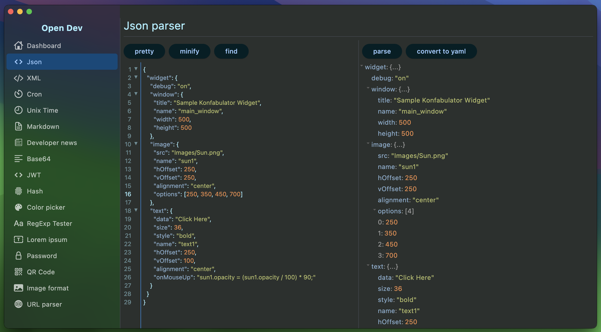
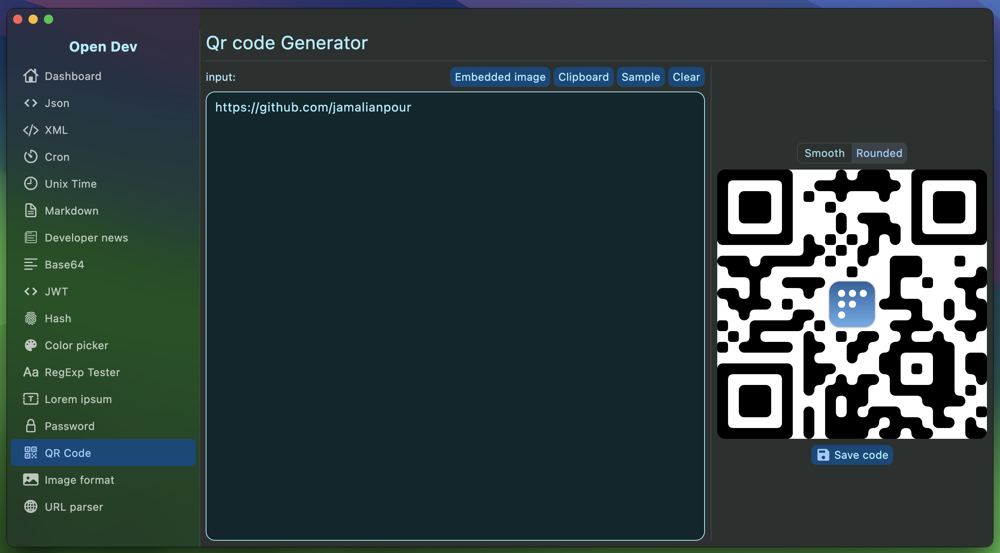
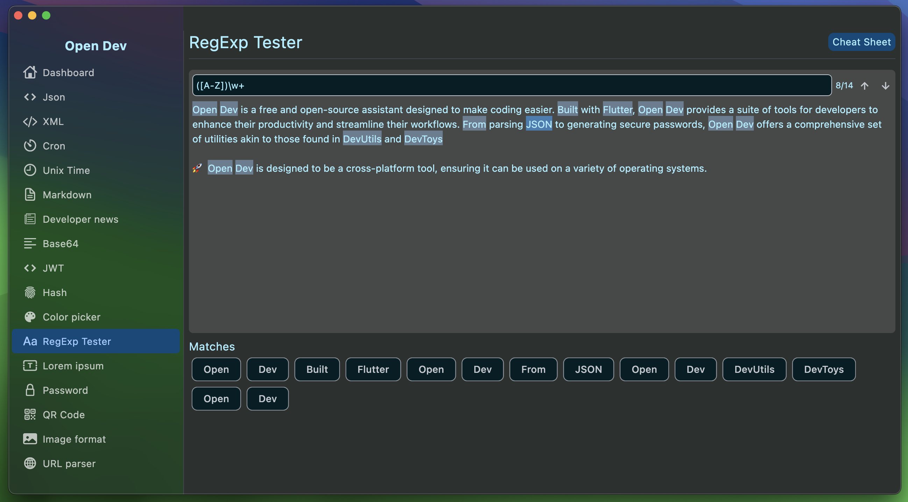
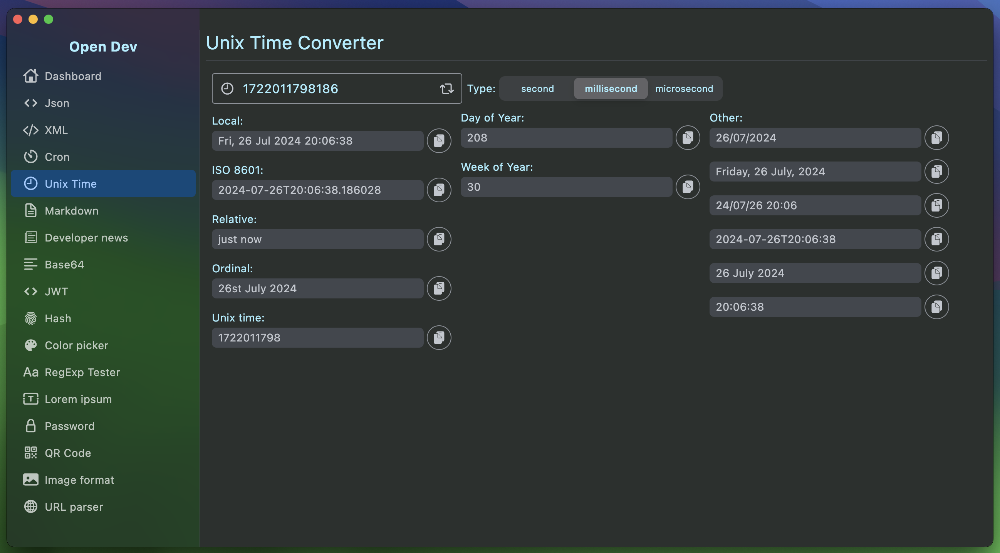
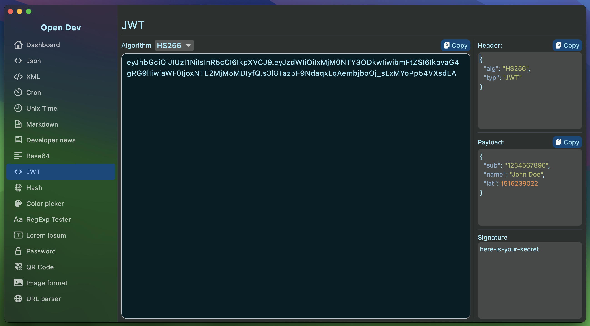

<div align="center">
  

  <h1>Open Dev</h1>

  <p><strong>A free, open-source developer toolbox.</strong><br/>
  27 essential utilities in one cross-platform app — JSON, YAML, JWT, hashes, regex, diff, cron, and more.</p>

  <p>
    <a href="https://github.com/Jamalianpour/open-dev/blob/main/LICENSE"></a>
    <a href="https://github.com/Jamalianpour/open-dev/releases"></a>
    <a href="https://github.com/Jamalianpour/open-dev/actions/workflows/ci.yml"></a>
    <a href="https://github.com/Jamalianpour/open-dev/stargazers"></a>
  </p>

  <p>
    <a href="https://jamalianpour.github.io/open-dev"><strong>Try it in your browser →</strong></a>
  </p>
</div>



---

## Why Open Dev?

- **Free and open source.** No subscription, no telemetry, no account required. Every tool runs locally — your data never leaves your machine.
- **Truly cross-platform.** macOS, Windows, Linux, and Web from one Flutter codebase. Same UI, same keyboard shortcuts, every desktop.
- **Built for developers — especially Flutter devs.** JSON → Dart class generation, Material-style color picker, and 25 more daily-driver tools.
- **Keyboard-first.** `⌘K` / `Ctrl+K` opens a fuzzy command palette over every tool. Star your favourites; recently used tools surface automatically.
- **Light *and* dark themes.** Toggle from the sidebar; on macOS and Windows 11 the native window chrome follows along.

A free alternative to [DevUtils](https://devutils.com/) (Mac, paid) and [DevToys](https://devtoys.app/) (Windows-first), with extra tools aimed at the Flutter ecosystem.

---

## Features

### 🔄 Encode / decode
- **Base64** — text *and* images, with side-by-side preview
- **URL** — encode and decode query strings
- **HTML** — entity encode/decode, including an attribute-safe mode
- **JWT** — decode, debug, verify with HS256 / HS384 / HS512

### 🛠 Format / convert
- **JSON** — pretty, minify, find, object-tree view, convert to YAML
- **XML** — pretty, convert to JSON
- **YAML → JSON** — round-trip your config files
- **CSV ⇄ JSON** — both directions, with table preview and configurable delimiter (`,` `;` `\t` `|`)
- **SQL formatter / minifier** — uppercases keywords, breaks clauses onto their own lines, strips comments
- **String case converter** — camelCase, snake_case, kebab, PascalCase, SCREAMING_SNAKE, COBOL-CASE, dot.case, path/case, Title, Sentence, UPPER, lower
- **JSON → Dart class** — generate null-safe Dart models with `fromJson`/`toJson`, toggle nullable and immutable
- **Number base** — convert between BIN / OCT / DEC / HEX with a bit-grid and bitwise operations (AND, OR, XOR, NOT, shifts) across 8/16/32/64 bits
- **Markdown** — write with live preview using GitHub-flavored Markdown

### ✨ Generate
- **Lorem ipsum** — paragraphs / sentences / words, optional "Lorem" prefix
- **Password** — random + memorable + passphrases, with character class toggles
- **QR code** — text or URL, with optional embedded image
- **UUID** — generate and decode v1, v4, v5, v6, v7, v8
- **Hash** — MD5, SHA-1/224/256/384/512 and HMAC variants
- **File hash** — drop any file, get all five checksums plus a built-in hash verifier

### 🔍 Inspect / test
- **Text & JSON diff** — line-level diff with `+`/`-` highlighting and side-by-side gutters; "JSON-aware" mode pretty-prints both sides first
- **Regex tester** — live matches, cheat sheet, case sensitivity
- **Hex viewer** — drop a file to see a classic offset / hex / ASCII dump
- **Color picker** — HEX, RGB, RGBA, HSL, HSLA, HSB, CMYK conversions with a color wheel
- **Unix timestamp** — seconds / milliseconds / microseconds ↔ ISO 8601, RFC 2822, ordinal, day-of-year
- **Cron expression** — human-readable description + the next *N* runs (5/10/20/50) in your chosen timezone

### 📰 Other
- **Image format converter** — between common formats (desktop only)
- **Developer news** — RSS reader for The Hacker News, DZone, MacRumors, Slashdot

---

## Quick navigation

| Shortcut | Action |
|---|---|
| `⌘K` / `Ctrl+K` | Open the command palette (fuzzy search across all tools) |
| `↑` / `↓` | Move between palette results |
| `↵` | Open the highlighted tool |
| `Esc` | Dismiss the palette |
| ★ on any palette row | Pin that tool to the sidebar's **Favorites** section |

Recently opened tools surface automatically under **Recent** in the sidebar.

---

## Screenshots

| Hash Generator                                          | JSON Parser and Converter to YAML              |
| ------------------------------------------------------- | ---------------------------------------------- |
|            |      |
| QR Code Generator                                       | RegExp Tester                                  |
|           |  |
| Unix Time Converter                                     | JWT Debugger                                   |
|   |      |

---

## Cross-platform support

| Platform | Status | Notes |
|---|---|---|
| **macOS** | ✅ Primary target | Hidden titlebar, native sidebar acrylic, brightness-synced window chrome |
| **Windows** | ✅ Supported | Mica effect on Windows 11; standard chrome on Windows 10 |
| **Linux** | ✅ Supported | Standard window chrome |
| **Web** | ✅ Supported | [Try in your browser](https://jamalianpour.github.io/open-dev). Image Format conversion is disabled (requires direct file-system access) |

---

## Install

### Pre-built binaries

Download the latest version from the [Releases](https://github.com/Jamalianpour/open-dev/releases) page.

### Build from source

Requires Flutter 3.22+.

```sh
git clone https://github.com/Jamalianpour/open-dev.git
cd open-dev
flutter pub get
flutter run                # native (auto-detect)
flutter run -d chrome      # web
flutter run -d macos       # macOS
flutter run -d windows     # Windows
flutter run -d linux       # Linux
```

To produce release artifacts:

```sh
flutter build macos        # macOS .app
flutter build windows      # Windows exe
flutter build linux        # Linux bundle
flutter build web          # static web bundle
dart run msix:create       # Windows MSIX installer
```

---

## Architecture

Open Dev follows a **single-registry pattern**: every tool is declared once in [`lib/utils/tool_registry.dart`](lib/utils/tool_registry.dart) as a `ToolEntry`. The sidebar, the PageView, the dashboard cards, the search index, and the command palette all read from that single list — so adding a new tool is a one-line change.

```
lib/
├── main.dart              # window setup + theme listener
├── utils/                 # pure logic per tool (testable, no Flutter imports)
├── views/                 # one StatefulWidget per tool
├── widgets/               # shared widgets (DataWidget, command palette, sidebar)
└── utils/tool_registry.dart  # ⬅ single source of truth
```

See [CLAUDE.md](CLAUDE.md) for deeper architecture notes and [CONTRIBUTING.md](CONTRIBUTING.md) for the four-step "add a tool" guide.

---

## Contributing

Pull requests are welcome. The [`CONTRIBUTING.md`](CONTRIBUTING.md) guide walks through:

1. Setting up the project (`flutter pub get`, running on each platform)
2. The four-step recipe for adding a new tool
3. Conventions for shared widgets, code editors, file pickers, and theming
4. Things to avoid (web-incompatible imports, hard-coded page indices, committing `DEVELOPMENT_TEAM` IDs)

CI runs `flutter analyze` and `flutter test` on every PR.

Good first issues live on the [Issues tab](https://github.com/Jamalianpour/open-dev/issues) — pick anything labelled `good first issue` or propose a new tool.

---

## License

[MIT](LICENSE) © Mohammad Jamalianpour.

---

## Support the project

If Open Dev saves you time:

- ⭐ **Star the repo** — the easiest way to help others discover it
- 🐛 **File an issue** when you hit a bug or want a new tool
- 🤝 **Send a PR** — see [CONTRIBUTING.md](CONTRIBUTING.md)

---

## Contact

- **Email:** jamalianmjp@gmail.com
- **Telegram:** [@j_mohada](https://t.me/j_mohada)
- **Issues / discussions:** [GitHub](https://github.com/Jamalianpour/open-dev)
